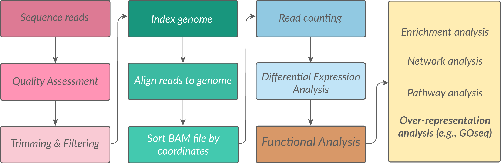
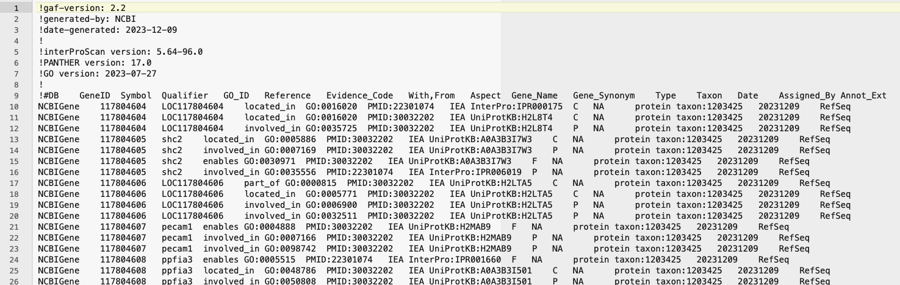
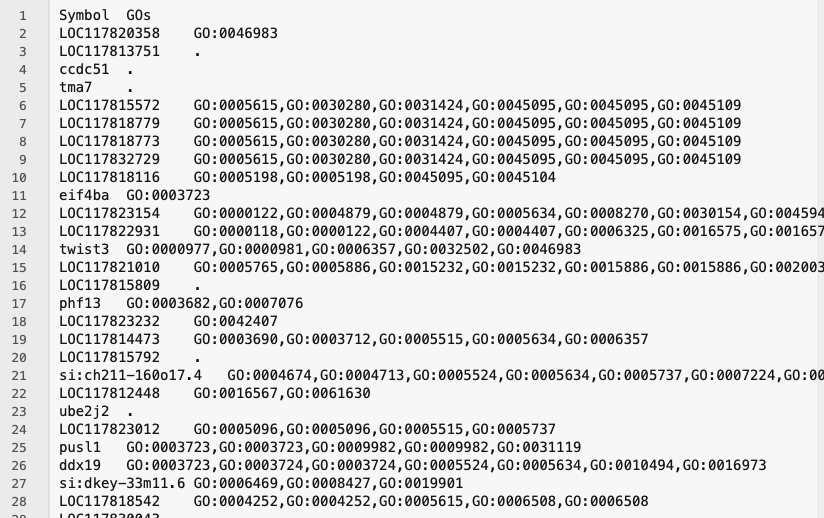

# Mini series: Gene ontology analysis for non-model organisms

In this workshop, we will cover how to perform gene ontology (GO) analysis for non-model organisms.  Specifically, we will run through GOseq analysis in R, focusing on how to perform this for organisms that **are not** in the supported organisms list in `goseq()` and don't have an annotation package in Bioconductor. You can check [if your research organism is listed here.](https://bioconductor.org/packages/release/BiocViews.html#___OrgDb) If not, this workshop might be for you.    

This is an extension on our [RNA-seq Data Analysis workshop](https://genomicsaotearoa.github.io/RNA-seq-data-analysis-workflow/), which covers GOseq analysis using the supported organism *Saccharomyces cerevisiae* in the lesson on Functional analysis.  

## Prerequisites

- Have attended our [Introduction to R](https://genomicsaotearoa.github.io/BioinformaticsTrainingProgramme/portfolio.html#intro-r) workshop or have equivalent experience.   
- Have attended our [RNA-seq Data Analysis](https://genomicsaotearoa.github.io/BioinformaticsTrainingProgramme/portfolio.html#rnaseq) workshop, or have previous experience with an RNA-seq workflow.     


### Set-up

1. Install or update [RStudio](https://posit.co/download/rstudio-desktop)
2. Install or update [R](https://cran.rstudio.com/)

R libraries needed for this workshop:
```{r}
#| eval: false

# From CRAN
install.packages("tidyverse")
install.packages("BiocManager")

# From Bioconductor
BiocManager::install("goseq")

# Load libraries
library(tidyverse)
library(goseq)
```

## Background

We start off our pipeline at *the end of the RNAseq read processing steps*, but at *the beginning of our gene expression analysis journey*. An exciting place to be!

In this scenario, we have already:

1. Sequenced our samples    
2. Trimmed, filtered, aligned our reads to a genome  
3. Produced a count matrix of read counts per gene per sample  
4. Performed differential expression analysis to identify differentially expressed genes (DEGs)   
5. Have a list of DEGs that we want to understand the biological significance of using gene ontology (GO) analysis.  

 


## What are gene ontologies (GO) and what is GO analysis?
Gene ontologies are a structured and standardised representation of biological knowledge. The GO is designed to be species-agnostic to enable the annotation of gene products across the entire tree of life. GOs are organised in three aspects: Molecular Function (MF), Cellular Component (CC), and Biological Process (BP). Read more about GOs on the [geneontology.org website](https://geneontology.org/docs/ontology-documentation/). 

GOseq analysis ([paper here](https://pmc.ncbi.nlm.nih.gov/articles/PMC2872874/)) is a powerful tool used to understand the biological significance of a list of genes, such as differentially expressed genes (DEGs) from an RNA-seq experiment. GO analysis helps to identify which biological processes, cellular components, or molecular functions are enriched in a given gene list. GOseq works by testing which GOs are overrepresented in a gene set compared to a background set of genes. GOseq is one type of overrepresentation analysis tool, but there are other tools such as [GSEA](https://www.pnas.org/doi/10.1073/pnas.0506580102) which use a different statistical approach *i.e.,* functional class sorting, rather than the hypergeometric testing done in GOseq. There are pros and cons to every approach.      

## What objects/files do I need to perform GOseq?
To perform GOseq, you typically need the following files or objects in R:  

1. **DE gene lists**: Character vectors of all the differentially expressed gene (DEGs) IDs to be tested. For each pairwise comparison, make two character vectors: one for upregulated genes and one for downregulated genes.
2. **Background genes**: A character vector of the background gene list.   
3. **Gene ontologies**: A dataframe that maps gene identifiers to GO terms.   
4. **Gene lengths**: A dataframe that maps  gene identifiers to gene lengths.     

The gene IDs used may be a gene symbol or another identifier such as Ensembl ID, but it should be the *same identifier* used in every file or object above, as they need to cross-match. If you are working outside of R to generate these objects above, save them as either tab delimited text files (for reading into R as a dataframe) or as a plain text file with each gene identifier on a new line (for reading into R as a character vector). 

### What do each of these objects/files look like?

... and how do we get them?

#### 1. **DE gene lists**.

📌💡 Make **character vectors** of your upregulated gene IDs and downregulated gene IDs, for each pairwise comparison.  

Since we are working in R, you likely will be pulling this data directly from your DGE results *e.g.,* the `dds` object created during DESeq2 analysis.

We are not focussing here on how to run DESeq2, see our RNA-seq data analysis workflow for this. 

::: {.callout-note collapse="true"}
# Code used to generate dds object

Counts and coldata files not supplied in this workshop. 

```{r}
#| message: false
library(DESeq2)
library(tidyverse)

# >> DGE-related variables ----
COUNTS_FILE = "data-files/readspergene_v2.matrix"
COLDATA_FILE = "data-files/coldata_v2.3.2.txt"

# Specify significance threshold
SIGNIFICANCE_CUTOFF = 0.001

# >> Counts file ----
counts.table = read.table(file=COUNTS_FILE, header = TRUE, sep = "\t", stringsAsFactors = FALSE, row.names = "GeneID")

# >> Coldata file ----
coldata.table = read.table(file=COLDATA_FILE, header = TRUE, sep = "\t", stringsAsFactors = FALSE, row.names = "sample")
#factorise
coldata.table$histov22 <- factor(coldata.table$histov22, levels=c("F","ET","MT","LT","TPM","IPM"))

# Create a DESeq2 object for pairwise comparisons
dds <- DESeqDataSetFromMatrix(countData = counts.table, colData = coldata.table, design = ~ histov22 )
dds <- estimateSizeFactors(dds)

# Drop low count genes
nc <- counts(dds, normalized=TRUE)
filter <- rowSums(nc >= 10) >= 2
dds <- dds[filter,]

# Run DESeq2
dds <- DESeq(dds)
res <- results(dds, alpha=SIGNIFICANCE_CUTOFF)
res <- res[order(res$padj),]
res <- na.omit(res)

# Extract pairwise comparison results 
comparisons = c("histov22_MT_vs_F")

# Initialise lists to store results
results_list <- list()
de_results_list <- list()


for (c in comparisons)
{
  # Extract relevant details from comparison
  cSplit <- strsplit(c, "_")
  contrast <- cSplit[[1]][1]
  group1 <- cSplit[[1]][2]
  group2 <- cSplit[[1]][4]
  
  # Obtain pairwise comparison of interest
  res.pw <- results(dds, alpha = SIGNIFICANCE_CUTOFF, contrast = c(contrast, group1, group2))
  
  # Clean up
  res.pw <- res.pw[order(res.pw$padj), ]
  res.pw <- na.omit(res.pw)
  
  # Convert to data frame and store full results
  results_list[[c]] <- as.data.frame(res.pw)
  
  # Get DE genes and store
  de_results_list[[c]] <- as.data.frame(res.pw[res.pw$padj < SIGNIFICANCE_CUTOFF, ])
}

# pull out into individual named objects - just one for this example!
df_MT <- de_results_list[["histov22_MT_vs_F"]]

# split up and down
dfMT_UP <- df_MT[df_MT$log2FoldChange > 0 ,] 
dfMT_DOWN <- df_MT[df_MT$log2FoldChange < 0 ,]

#test - should be true
nrow(dfMT_UP) + nrow(dfMT_DOWN) == nrow(df_MT)

# gene list objects as character vectors
genes_MT_UP <- rownames(dfMT_UP) 
genes_MT_DOWN <- rownames(dfMT_DOWN)
```

```{r}
#| echo: false

#saveRDS(dds, file = "data-files/dds.rds")
saveRDS(genes_MT_UP, file = "data/genes_MT_UP.rds")
saveRDS(genes_MT_DOWN, file = "data/genes_MT_DOWN.rds")
```

:::

No matter how you get there, in the end you want two lists of DE genes for each pairwise comparison, stored in R as character vectors.

You should have one list of **upregulated** genes and one list of **downregulated** genes, for each pairwise comparison.

In the example below, the two objects we are using are from a pairwise comparison between female (F) gonads and mid-transitioning (MT) gonads from a sex-changing fish species *Notolabrus celidotus* (New Zealand spotty wrasse).

The objects should look like this when you run the `str()` function on them:

```{r}
str(genes_MT_UP)
str(genes_MT_DOWN)
```


#### 2. **Background genes**:

📌💡 Make a **character vector** of all gene IDs that you want to use as a background for your GO analysis. 

You need to think carefully about what you want to use as your background gene list. Generating it is fairly straight forward, but it has implications for the analysis. Read more on how overrepresentation analysis works and how the background gene list is used in the analysis [here in the functional analysis section of the RNA-seq workshop](https://genomicsaotearoa.github.io/RNA-seq-data-analysis-workflow/episode_5.html). 

For now, we will use all genes that are expressed in our dataset as the background. We will take these gene IDs by pulling all the rownames out of the `dds` object:

> Note: earlier when dds was created, low count genes were filtered out, which removed genes not expressed (*i.e.,* zero counts across all samples) and genes very lowly expressed (*i.e.,* less than 10 counts in at least 2 samples).

```{r}
background <-  rownames(dds)
str(background)
```

```{r}
#| echo: false
saveRDS(background, file = "data/background.rds")
```

::: {.callout-tip collapse="true"}
# Checks and food for thought

What does *expressed* really mean in this context? If one of our genes in our dataset had one read mapping to it in one sample, and all other samples had zero, would you consider this an expressed gene? Most of us probably would agree this does not seem sufficient. Deciding on a read count threshold is up to you as a researcher. In this example above, we used a threshold of 10 counts in at least 2 samples. So in this way, our background of expressed genes will be less than the total number of genes in the genome, but more than the number of DE genes.

We can confirm that there are less genes in the background then there are in the whole list of genes in the genome by running:

```{r}
length(background)
nrow(counts.table)
```

:::


#### 3. **Gene ontologies**

📌💡 Make either a **dataframe** or a **tab delimited text file** with two columns that maps gene identifiers to GO terms.

The gene identifier should match the same identifiers used in the DGE list and background genes. This file should contain every gene in your genome; we filter out the genes we want for analysis later. Multiple GO terms for a single gene are separated by commas and genes with no GO term should have a `.`{style="color:black"} You should have an entry for every gene in your genome (or more specifically, every gene for which reads can be mapped in your RNA-seq alignment *i.e.,* every gene represented in your count matrix). Whether you have a tab delimited text file or a dataframe in R, it should look something like this:

```
GeneID	        GOs
LOC117820358	GO:0046983
LOC117813751	.
ccdc51	        .
tma7	        .
LOC117815572	GO:0005615,GO:0030280,GO:0031424,GO:0045095,GO:0045109
pusl1           GO:0003723,GO:0003723,GO:0009982,GO:0009982,GO:0031119
ddx19           GO:0003723,GO:0003724,GO:0003724,GO:0005524,GO:0005634,GO:0010494,GO:0016973
cdab            GO:0004126,GO:0004126,GO:0005829,GO:0008270,GO:0008270,GO:0009972,GO:0009972
LOC117818116	GO:0005198,GO:0005198,GO:0045095,GO:0045104
...             ...
```

If your data is a text file, you should read it into R as a dataframe. The first row should be the header. `read_tsv()` from `readr` by default treats the first row as the header.  If you use `read_delim` from `utils` you can specify header is true (or false if you have no header) and the separator is tab (or alternate delimiter).

Example code:
```{r}
#| eval: false

geneOntologies <- read_tsv("geneOntologies.txt")
geneOntologies <- read.delim("geneOntologies.txt", header = TRUE, sep = "\t")

```


::: {.callout-note collapse="true"}
# How do I get gene ontologies?


***Option 1 (easier):*** Download the `.gaf` file from the genome release for your organism and re-arrange into the required format.

This will likely come from NCBI's FTP database [https://ftp.ncbi.nlm.nih.gov/](https://ftp.ncbi.nlm.nih.gov/).   

See the Gene Ontology website for more information about getting GO annotations [https://geneontology.org/docs/download-go-annotations/](https://geneontology.org/docs/download-go-annotations/)

The gaf file looks like this. You will need to take the 'Symbol' column and the 'GO_ID' column to make your gene ontology file. You will also need to collapse multiple GO terms for a single gene into a single cell, separated by commas. Genes with no GO term should have a `.`{style="color:black"}


The final gene ontology file should look like this (tsv format):


***Option 2 (harder):*** Derive GOs from BLAST and Pfam annotations. This is more work, but may be necessary if you don't have a `.gaf` file available for your organism. You can use tools like `InterProScan` to annotate your genes with GO terms based on their sequence similarity to known proteins. BLAST2GO is another tool (commercial - need a license) that can be used to assign GO terms to genes based on BLAST results (*i.e.,* BLASTing against organisms that *do* have GO annotations, usually from the evolutionarily nearest model organism!). This approach may be more time-consuming and may not yield as comprehensive GO annotations as using a `.gaf` file, but it can be a useful alternative for non-model organisms. If you generate Pfam annotations through another pipeline (*e.g.,* through hmmer) you may also need to download the latest [PFAM2GO mapping file](https://current.geneontology.org/ontology/external2go/pfam2go) to retrieve GO terms for your genes based on their Pfam domains.


:::


#### 4. **Gene lengths**  

📌💡 Make either a **dataframe** or **tab delimited text file** with two columns that maps gene identifiers to gene lengths (in bp)  

The gene identifier should match the identifiers used in the DGE list and background genes. The gene length is in base pairs (bp) and should be whole numbers (no decimal places). You should have an entry for every gene in your genome (or more specifically, every gene for which reads could be mapped to in your RNA-seq alignment *i.e.,* every gene represented in your count matrix).
Whether you have a tab delimited text file or a dataframe in R, it should look something like this:  

```
GeneID	        Length
LOC117820358	822
LOC117813751	23247
ccdc51	        6138
tma7	        6649
LOC117815572	3004
LOC117818779	3782
LOC117818773	4401
LOC117832729	22180
LOC117818116	5860
eif4ba	        22986
twist3	        6717
...             ...
```

If your data is a text file, you should read it into R as a dataframe. The first row should be the header. `read_tsv()` from `readr` by default treats the first row as the header.  If you use `read_delim` from `utils` you can specify header is true (or false if you have no header) and the separator is tab (or alternate delimiter).

Example code:
```{r}
#| eval: false

geneLengths <- read_tsv("geneLengths.txt")
geneLengths <- read.delim("geneLengths.txt", header = TRUE, sep = "\t")

```

::: {.callout-note collapse="true"}
# How do I get gene lengths?

Getting gene lengths sounds straightforward, but it depends on how you define the length of a gene — and there are several reasonable definitions that give different answers.

One approach is to use the **genomic span** of a gene: the distance from the first base to the last base across the gene body. This is easy to extract from a GFF/GTF file but includes introns, which are not actually transcribed into mature mRNA.

A more accurate definition for RNA-seq purposes is the **union exon length**: the total number of base pairs covered by exons, after merging overlapping exons from different isoforms of the same gene. This better reflects the sequence that reads actually map to.


Ideally, make a file/object that has gene lengths for *all genes in your genome* -- you will filter out the genes you need for analysis later.


***Option 1 (easiest):*** If you used `featureCounts` to generate read counts, extract the `Length` column from the output. This column contains the union exon length for each gene (assuming you used `-t exon` and `-g gene_id` options when running `featureCounts`).

***Option 2 (easy enough):*** Use the gene annotation file (e.g., GFF3 or GTF) for your organism, and use a package such as `GenomicRanges` to extract the union exon length for each gene. 


::: {.callout-note collapse="true"}
# The code for option 2 this should look something like this:

```{r}
#| message: false
# generate gene lengths from gtf

# BiocManager::install(c("GenomicRanges", "rtracklayer"))
library(GenomicRanges)
library(rtracklayer)

# Import only exon features
exons <- import("data-files/GCF_009762535.1_fNotCel1.pri_genomic.gtf", feature.type = "exon")
exons <- exons[!is.na(exons$gene_id)] # optional

# Split by gene, reduce overlapping exons, sum widths
exons_reduced <- GenomicRanges::reduce(split(exons, exons$gene_id))

geneLengths <- data.frame(
  GeneID = names(exons_reduced),
  Length = sapply(exons_reduced, function(x) sum(width(x))),
  row.names = NULL
)

head(geneLengths)


```

```{r}
#| echo: false
saveRDS(geneLengths, file = "data/geneLengths.rds")
```

:::

***Option 3 (de novo assembly):*** Lastly, if you are doing *de novo* transcriptome assembly, you may want to use the weighted average length of the assembled transcript as the gene length (and you will need to round this number to the nearest whole number). This approach uses how expressed each isoform is (TPM) to weight how much each isoform length contributes to the calculated average gene length - [read more here on the trinity rnaseq wiki.](https://github.com/trinityrnaseq/trinityrnaseq/wiki/Running-GOSeq)


:::


## Running GOseq analysis


First let's load in and orientate ourselves to our objects. We'll pull in example data from our Genomics Aotearoa GitHub repository.  

```{r}
#| echo: false
genes_MT_UP <- read_rds("data/genes_MT_UP.rds")
genes_MT_DOWN <- read_rds("data/genes_MT_DOWN.rds")
background <- read_rds("data/background.rds")
geneLengths <- read_rds("data/geneLengths.rds")
geneOntologies <- read_rds("data/geneOntologies.rds")

```
```{r}
#| eval: false

# load in all objects
genes_MT_UP <- read_rds("https://raw.githubusercontent.com/GenomicsAotearoa/genomics-mini-series/main/data/genes_MT_UP.rds")
genes_MT_DOWN <- read_rds("https://raw.githubusercontent.com/GenomicsAotearoa/genomics-mini-series/main/data/genes_MT_DOWN.rds")
background <- read_rds("https://raw.githubusercontent.com/GenomicsAotearoa/genomics-mini-series/main/data/background.rds")
geneLengths <- read_rds("https://raw.githubusercontent.com/GenomicsAotearoa/genomics-mini-series/main/data/geneLengths.rds")
geneOntologies <- read_rds("https://raw.githubusercontent.com/GenomicsAotearoa/genomics-mini-series/main/data/geneOntologies.rds")

```

```{r}
#| eval: false

# Orientate yourself to variables 
head(genes_MT_UP) 
head(genes_MT_DOWN)
head(background)
head(geneLengths)
head(geneOntologies)
```

We need to do some pre-analysis processing. First the gene ontologies need to be reformatted into a list. 

```{r}
# Generate GO mapping structure, final object splitgoannot list ----
geneOntologies[geneOntologies == "."] <- NA #change all dots to NAs
splitgoannot <-  strsplit(geneOntologies[,2], split=',')
names(splitgoannot) <-  as.vector(geneOntologies[,1])
```
The splitgoannot object is a large list. You can check the structure of it by running `str(splitgoannot)`. The names of the list are the gene IDs, and the values are vectors of GO terms.

Next we need to turn our gene lengths into a named vector.

```{r}
# Load in gene lengths, final object length.vector is a named vector  ----
# note - lengths must be whole numbers, use as.integer(round(genelengths$Length)) if you have decimal places.
length.vector <- setNames(geneLengths$Length, geneLengths$GeneID)
length(length.vector)
head(length.vector)
```

We will now cull the length.vector to only contain the genes that are in our background gene list. It is best to start with a length vector that contains all genes in the genome; this way if you decide to change your background gene list later, you won't have to go back and re-generate the original length vector. If you get errors below (or a FALSE in the test), it may be that there are genes in your background gene list that don't have a length in the length vector. This could happen if you missed genes from the genome when you generated your original length file and would have to go back and check your work.   

```{r}
# Cull length.vector that don't show up in the background gene list. 
length.vector <-  length.vector[names(length.vector) %in% background]  

#test - should be TRUE 
length(length.vector) == length(background)
```

The last thing we need to do before running GOseq is to generate a named vector of 0s and 1s, where the names are the gene IDs in our background gene list, and the values are 1 if the gene is a DEG and 0 if it is not. We will generate this for both our upregulated and downregulated gene lists.

We'll start with the upregulated gene list.


```{r}
# Create a vector identifying which genes are identified as DE in this analysis
DE.vector <- background  %in%  genes_MT_UP

## test - should be TRUE
## sum counts up how many TRUE are in the DE.vector object, and there should be a TRUE in each position where a gene matched the genes listed in genes_MT_UP
sum(DE.vector) == length(genes_MT_UP)

# Convert TRUE to 1 and FALSE to 0
DE.vector <-  DE.vector * 1 
## turn the DE.vector into a named vector, where the names are the gene IDs in the background gene list.
names(DE.vector) <-  background
## test again- should still be TRUE
sum(DE.vector) == length(genes_MT_UP)

# last test - DE.vector should have the same number of genes as the length.vector now.
length(DE.vector) == length(length.vector) 
```

Now we are ready to run the two step GOseq analysis! in the `nullp()` function, the object `DE.vector`, used for the `DEgenes` argument is the same as we'd have made if we ran this analysis using a supported organism, but the `bias.data` argument differs here (and we also don't specify which genome and gene ID type we are using, as we would if we were using a supported organism!). The argument `gene2cat` in `goseq()` is where we input our custom gene ontology mapping file, which is also different to how we'd run this if we were using a supported organism.    

```{r}
#| message: false

# BiocManager::install("goseq")
library(goseq)

# Run PWF for length bias correction
data.pwf <- nullp(DEgenes=DE.vector, bias.data=length.vector)  
# Run GOseq 
go_output <- goseq(data.pwf, gene2cat = splitgoannot)
```

### Processing the GOseq results

The go_output object is a dataframe that contains all the GO terms that were tested, but is not filtered to only show significant results. The columns `over_represented_pvalue` and `under_represented_pvalue` contain the p-values for over-representation and under-representation of each GO term, respectively. We can filter the go_output dataframe to only show significant results based on a chosen significance threshold.

In this specific example, we were investigating genes upregulated in mid-transitioning (MT) gonads compared to female gonads (F) and so our output file names reflect this. 

```{r}
# Limit output to significant results
GOSEQ_SIGNIFICANCE_THRESHOLD = 0.05

go_output.SIG.MT_UP <-  go_output[go_output$over_represented_pvalue <= GOSEQ_SIGNIFICANCE_THRESHOLD | go_output$under_represented_pvalue <= GOSEQ_SIGNIFICANCE_THRESHOLD,]
```

```{r}
#| eval: false
# Write output to tsv files 
write_tsv(go_output, file="MT_UP_vs_F_goseq.tsv")
write_tsv(go_output.SIG.MT_UP, file="MT_UP_vs_F_sig0.05_goseq.tsv")
```

We have run through GOseq now for one comparison, which is MT UP vs F, but we havent looked at genes downregulated in MT (MT DOWN vs F).


::: {.callout-note collapse="true"}
# Run through the pipeline again for MT DOWN vs F

We have to re-run GOSeq, but some objects we can keep, others we need to remake. 

**keep** background  
**keep** length.vector  
**keep** splitgoannot 

**remake** DE.vector  
**remake** data.pwf  
**remake** go_output  

Let's remove those to be sure we re-create them with our new data!
```{r}
rm(DE.vector)
rm(data.pwf)
rm(go_output)
```

Run through pipeline again with MT_DOWN

```{r}
#| message: false

DE.vector <- background  %in%  genes_MT_DOWN
sum(DE.vector) == length(genes_MT_DOWN) ## test - should be TRUE
DE.vector <-  DE.vector * 1 
names(DE.vector) <-  background
sum(DE.vector) == length(genes_MT_DOWN) ## test again- should still be TRUE
length(DE.vector) == length(length.vector) ## test - should be TRUE
data.pwf <- nullp(DEgenes=DE.vector, bias.data=length.vector)  
go_output <- goseq(data.pwf, gene2cat = splitgoannot)
go_output.SIG.MT_DOWN <-  go_output[go_output$over_represented_pvalue <= GOSEQ_SIGNIFICANCE_THRESHOLD | go_output$under_represented_pvalue <= GOSEQ_SIGNIFICANCE_THRESHOLD,]
```

```{r}
#| eval: false
# Write output to tsv files 
write_tsv(go_output, file="MT_DOWN_vs_F_goseq.tsv")
write_tsv(go_output.SIG.MT_DOWN, file="MT_DOWN_vs_F_sig0.05_goseq.tsv")
```

:::


### Organise data further into over and underrepresented 

Our output above contains results filtered down to only significant results, but it still contains both over-represented and under-represented GO terms, which need to be considered separately. 

We should end up with 4 objects or files for each pairwise comparison:

1. Upregulated genes - over-represented GO terms  
2. Upregulated genes - under-represented GO terms  
3. Downregulated genes - over-represented GO terms  
4. Downregulated genes - under-represented GO terms  

As you can imagine, this can end up being a lot of files if you have many pairwise comparisons!


We're going to need a new column Gene Ratio for plotting later, so we will generate that now before we split the data into over and under-represented. The Gene Ratio is the number of DE genes in the GO term divided by the total number of genes in that GO term. This is the proportion of DE genes with that GO term *e.g.,* a Gene ratio of 0.5 means that 50% of the genes in that GO term are DE.

For today, we'll do this for upregulated genes only. 

```{r}
library(dplyr)

go_output.SIG.MT_UP <- go_output.SIG.MT_UP |>
  mutate(GeneRatio = numDEInCat / numInCat)

```

Split into over and under-represented GO terms for upregulated genes.

```{r}
goout_MT_UP_over  <- go_output.SIG.MT_UP[go_output.SIG.MT_UP$over_represented_pvalue  < GOSEQ_SIGNIFICANCE_THRESHOLD, ]
goout_MT_UP_under <- go_output.SIG.MT_UP[go_output.SIG.MT_UP$under_represented_pvalue < GOSEQ_SIGNIFICANCE_THRESHOLD, ]
```

```{r}
# test - should be TRUE
nrow(goout_MT_UP_over) + nrow(goout_MT_UP_under) == nrow(go_output.SIG.MT_UP)
```

There are often less under-represented GO terms than over-represented; we can check how many GOs are in each df with:

```{r}
#| eval: false
nrow(goout_MT_UP_over)
nrow(goout_MT_UP_under)
```

### Plot data

Lastly, let's create a bubble plot to represent the top 10 over-represented GO terms for upregulated genes in MT vs F. We will use the GeneRatio column we generated above for the x-axis, and we will colour the bubbles by the -log10 of the p-value, which is a common way to visualise p-values in GO analysis. Using a negative log scales very small p-values (most significant) and larger pvalues on a visually more manageable scale, and means that the bigger the number the more significant (here, small p-values become higher numbers and are coloured red). We'll also scale the size of the bubbles by the number of DE genes in that GO term, so that GO terms with more DE genes are larger bubbles.


```{r}

goout_MT_UP_over |>
  filter(!is.na(ontology)) |>
  slice_min(over_represented_pvalue, n = 10) |>
  ggplot(aes(x = GeneRatio,
             y = reorder(str_wrap(term, width = 35), GeneRatio),
             size = numDEInCat,
             colour = -log10(over_represented_pvalue))) +
  geom_point() +
  scale_colour_gradient(low = "steelblue", high = "firebrick",
                        name = "-log10(p-value)") +
  scale_size_continuous(name = "DE gene count", range = c(2, 10)) +
  labs(title = "Over-represented GO terms for upregulated genes in MT, vs F",
       x = "Gene Ratio", y = NULL) +
  theme_bw()
```


#### Further plots, next steps and additional resources  


There are many other plots you can generate with GO terms. Another simpler option with the objects/data we already have is a barplot of overrepresented GOs vs GeneRatio, in the callout below.  

::: {.callout-tip collapse="true"}
# Example barplot of GOs vs GeneRatio

```{r}
library(ggplot2)
goout_MT_UP_over |> 
  filter(!is.na(ontology)) |> 
  slice_min(over_represented_pvalue, n=5) |> #top N by pvalue eg top 10 or 20. Note slice_min = smallest pvalue, slice_max = largest pvalue
  ggplot(aes(x = reorder(str_wrap(term, width = 18), GeneRatio), 
             y = GeneRatio, fill = -log10(over_represented_pvalue))) +
  geom_bar(stat = "identity") +
  coord_flip() +
  scale_fill_gradient(low = "steelblue", high = "firebrick") +
  scale_y_continuous(expand = c(0, 0)) + # Removes extra padding
  labs(title="Over-represented GO terms for genes upregulated in MT, vs F",x = "GO Term", y = "GeneRatio", fill = "-log10(p-value)") + 
  theme_classic()
```


:::

The `clusterProfiler` package is a great tool for exploring and plotting GO terms too. You will likely need to do some minimal data manipulation/reformatting of the objects we made today to work with clusterProfiler, as shown in the example below. Check out [this guide here](https://yulab-smu.top/biomedical-knowledge-mining-book/enrichplot.html) on different ways to visualise results. 


::: {.callout-tip collapse="true"}
# Example GO enrichment map plot  

```{r}
#| message: false

# BiocManager::install(c("clusterProfiler", "enrichplot", "GO.db"))
library(clusterProfiler)
library(enrichplot)


# Step 1: reformat your geneOntologies into long format 
# clusterProfiler's enricher() needs a two-column dataframe:
#   col 1 = GO term  (TERM2GENE format: term first, gene second)
#   col 2 = gene ID
# You already have geneOntologies loaded (GeneID | GOs), so we just
# split the comma-separated GOs and pivot to long format.

term2gene <- geneOntologies |>
  filter(GOs != ".") |>                          # drop genes with no annotation
  separate_rows(GOs, sep = ",") |>               # one row per GO term
  mutate(GOs = trimws(GOs)) |>                   # tidy any whitespace
  select(GOs, Symbol)                             # term first, gene second
# (enricher expects TERM2GENE with term in col 1, gene in col 2)

head(term2gene)

# Step 2: download and generate term2name variable 
# We need the GO term and the name e.g., GO:0000001 and 'mitochondrion inheritance' for plotting
library(GO.db)

term2name <- AnnotationDbi::select(GO.db, keys = keys(GO.db), columns = c("GOID", "TERM"))
term2name <- dplyr::select(term2name, GOID, TERM) 

head(term2name)

# Step 3: run enricher() 
# universe = your background gene list (same as goseq)
# gene     = your DE gene list (same as goseq)


cp_result <- enricher(
  gene          = genes_MT_UP,
  universe      = background,
  TERM2GENE     = term2gene,
  TERM2NAME     = term2name,
  pvalueCutoff  = 0.05,
  qvalueCutoff  = 0.05,
  pAdjustMethod = "BH"
)


# Step 4: calculate semantic similarity
# emapplot requires the pairwise similarity between terms to be calculated first. This creates a similarity matrix. 
cp_result_sim <- pairwise_termsim(cp_result)


# Step5: Visualisation
emapplot(cp_result_sim, 
         showCategory = 30,         # change how many GOs on plot
         size_category = 1,         # change size of bubbles
         node_label_size = 3,       # change GO font size
         ) +    
  labs(title = "GO term enrichment map: upregulated genes in MT, vs F")
```

:::


##### Next steps 📈

Other analyses you may want to consider is investigating KEGG pathways (example [KEGG enrichment analysis workflow here](https://yulab-smu.top/biomedical-knowledge-mining-book/022-kegg.html)) and weighted gene co-expression network analysis (*i.e.,* WGCNA. [Paper here.](https://link.springer.com/article/10.1186/1471-2105-9-559)). Both can be integrated with or utilise GOseq tools. KEGG ontology terms can be used in place of GO terms to perform overrepresentation analysis using the `goseq()` function. WGCNA can identify lists of genes that co-expressed, and that list can then be used as your input gene list in place of your DGE list for GOseq analysis.    

If you really want to use tools designed for supported organisms, it is possible, but not trivial, to make a custom OrgDb for your organism, using one of two available functions from the [`AnnotationForge`](https://www.bioconductor.org/packages/release/bioc/html/AnnotationForge.html) package `makeOrgPackage()` or `makeOrgPackageFromNCBI()`

##### Additional resources 📚

- [Functional Analysis for RNA-seq by HBC training](https://hbctraining.github.io/DGE_workshop_salmon/lessons/functional_analysis_2019.html)   
- [GOseq paper](https://pmc.ncbi.nlm.nih.gov/articles/PMC2872874/)  
- [GSEA paper](https://www.pnas.org/doi/10.1073/pnas.0506580102)  
- [Further plotting examples using `clusterProfiler`](https://yulab-smu.top/biomedical-knowledge-mining-book/enrichplot.html). 
- [GOSemSim](https://bioconductor.org/packages/release/bioc/html/GOSemSim.html) package for semantic similarity computation.    

